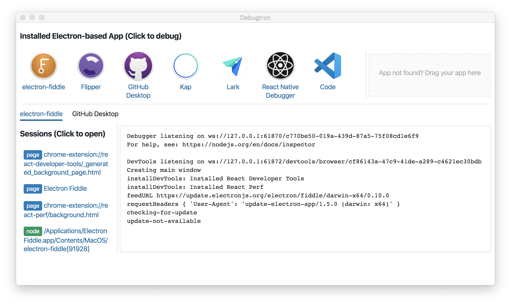

# Debugtron

Debugtron is an app to debug in-production Electron based app. It is also built with Electron.

## Installation

Installation binaries are available at [release page](https://github.com/pd4d10/debugtron/releases).

## License

MIT
